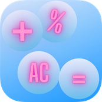
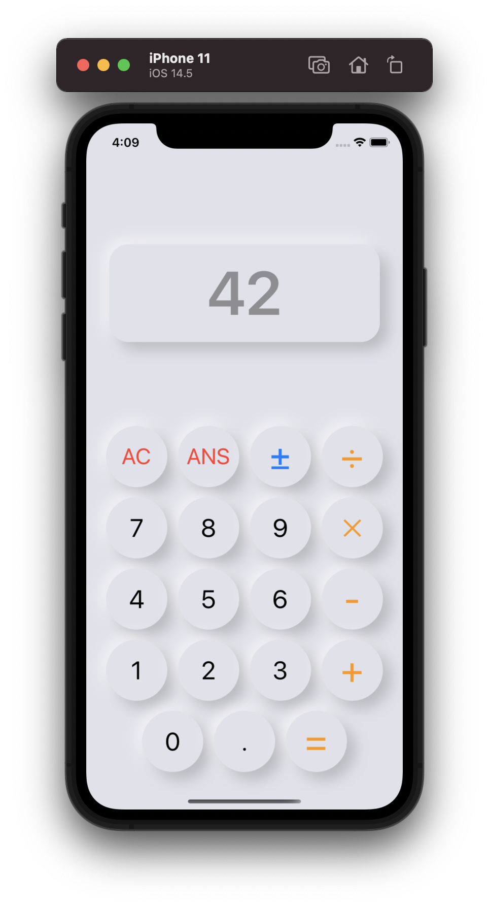
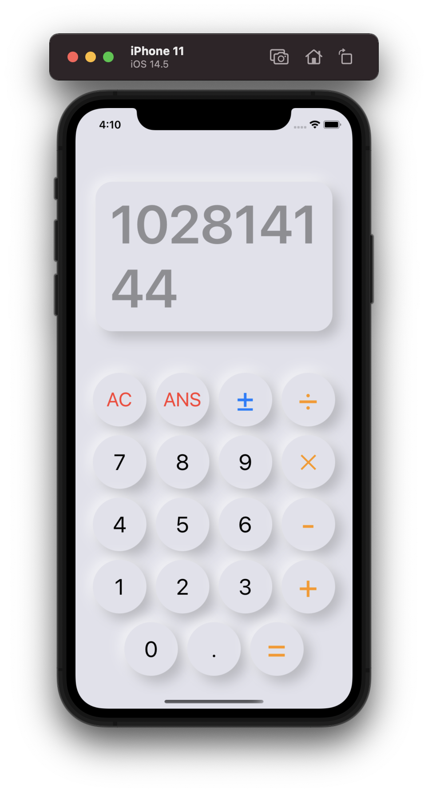
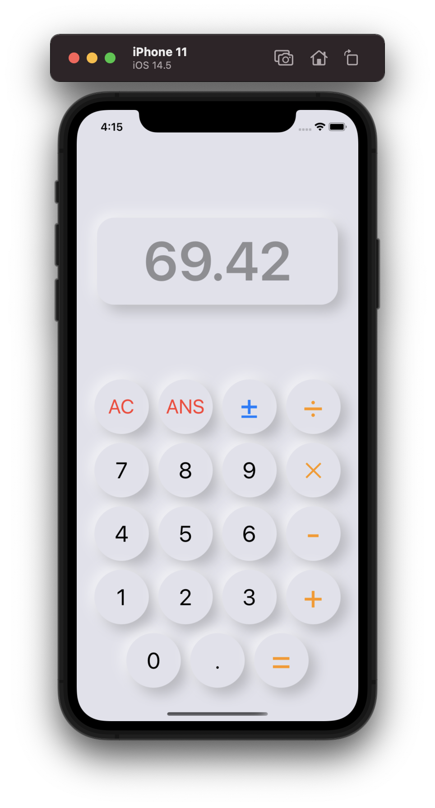

# Calnewlator Application

  

Created this application to implement the logic behind the basic operations of a calculator. The UI is the new Neumorphic Design. The app is written in SwiftUI.

## Demo

  

## Screenshots

